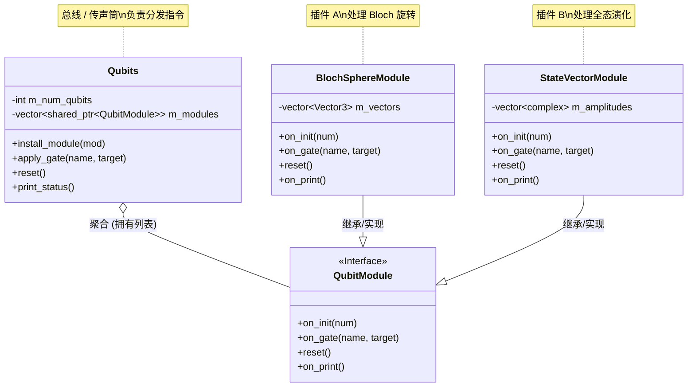
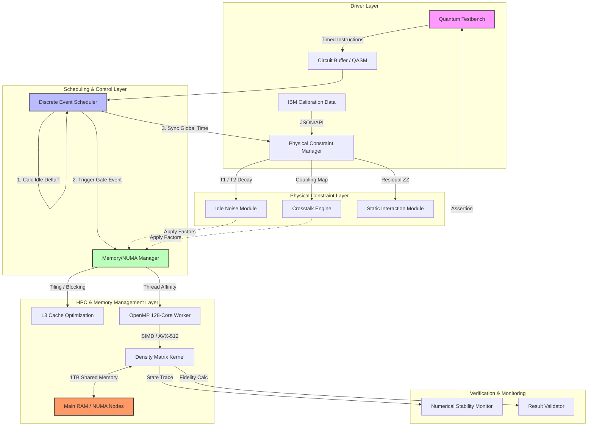

## Qubit model

## 时钟树

1.建议分区域，qubit附近采用差分低频信号
2.注意在差分线路加入延时
3.使用时钟分发模块
4.避免glitch
5.差分信号做低摆幅评估

## 实验
1.慢速有时间差的时钟向qubit和gates发送流水线指令
vs
2.指令堆集在qubit附近，传入低平时钟，然后在PLL产高速时钟爆发执行

## 密度矩阵
1.多线程
2.串扰等操作不要操作整个矩阵