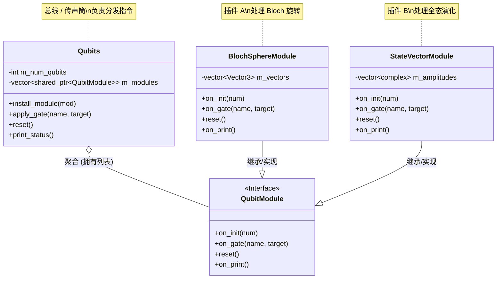

# Qubit model

```mermaid

classDiagram
    class Qubits {
        -int m_num_qubits
        -vector~shared_ptr~QubitModule~~ m_modules
        +install_module(mod)
        +apply_gate(name, target)
        +reset()
        +print_status()
    }

    class QubitModule {
        <<Interface>>
        +on_init(num)
        +on_gate(name, target)
        +reset()
        +on_print()
    }

    class BlochSphereModule {
        -vector~Vector3~ m_vectors
        +on_init(num)
        +on_gate(name, target)
        +reset()
        +on_print()
    }

    class StateVectorModule {
        -vector~complex~ m_amplitudes
        +on_init(num)
        +on_gate(name, target)
        +reset()
        +on_print()
    }

    %% 关系描述
    Qubits o-- QubitModule : 聚合 (拥有列表)
    BlochSphereModule --|> QubitModule : 继承/实现
    StateVectorModule --|> QubitModule : 继承/实现

    %% 注释
    note for Qubits "总线 / 传声筒\n负责分发指令"
    note for BlochSphereModule "插件 A\n处理 Bloch 旋转"
    note for StateVectorModule "插件 B\n处理全态演化"
```